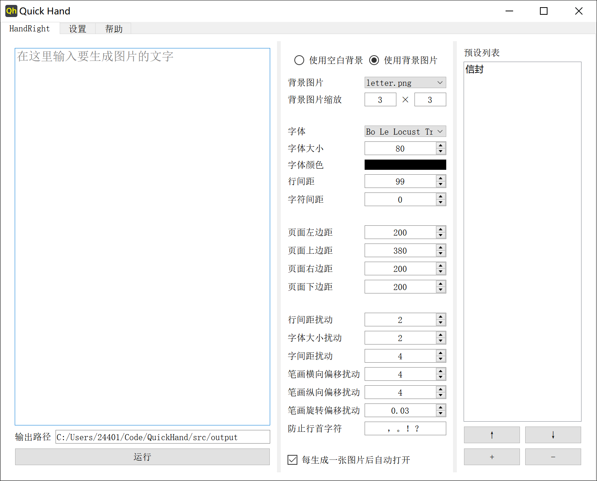
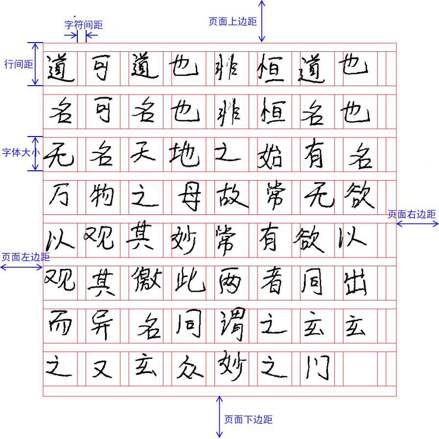

#   Quick Hand

## 📝 介绍
快速的仿手写文字的图片生成器。基于 https://github.com/Gsllchb/Handright/ 的 GUI。

它是开源的，你可以免费使用它。下载请到 release 界面。

目前在两个仓库更新：

- https://github.com/HaujetZhao/QuickHand
- https://gitee.com/haujet/QuickHand

关于软件参数的帮助，你可以参照：https://github.com/Gsllchb/Handright/blob/master/docs/tutorial.md

界面预览：




## 🔮 使用说明

原理：首先，在水平位置、竖直位置和字体大小三个自由度上，对每个字的整体做随机扰动。随后，在水平位置、竖直位置和旋转角度三个自由度上，对每个字的每个笔画做随机扰动。

Windows 64 位系统的用户：下载软件发行版压缩包，解压，双击运行里面的 `QuickHand.exe` 就可以运行了。

- 请将需要用到的字体文件（ttf 格式）放到软件根目录的 `fonts` 文件夹中
- 请将需要用到的背景图片放到软件根目录的 `backgrounds` 文件夹中

排版关系参考：



## 🔨 参与贡献

作者只有 Win10 64 位系统。如果你用的是其它系统电脑，比如 windows 32 位、MacOS、Linux，你可以参与志愿打包。

只要安装上 requirements.txt 中的 python 依赖包，确保源码能跑起来，再用 pyinstaller 使用以下的命令将 QuickHand.py 打包：

```
lss

```

再将：

- `backgrounds` 文件夹
- `fonts` 文件夹
- `assets` 文件夹
- `README_zh.html` 文件
- `database.db` 文件
- `icon.ico` 文件
- `sponsor.jpg` 文件
- `style.css` 文件

都复制到打包出的 QuickHand 文件夹根目录，再打包成压缩包，即可。

Linux 和 MacOS 用户可能还需要将打包出的 QuickHand 文件夹根目录内的可执行文件加上执行权限才行，并且不能用 zip 等打包格式，因为这会使得可执行权限丢失。建议使用 tar.gz 格式压缩。

MacOS 用户不能使用 `icon.ico` 图标，请手动将其转换为 `icon.icns` 格式图片，放到打包出的 QuickHand 文件夹根目录内。

## ☕ 打赏

万水千山总是情，一块几块都是情。本软件完全开源，用爱发电，如果你愿意，可以以打赏的方式支持我一下：


## 😀 交流

如果有软件方面的反馈可以提交 issues，或者加入 QQ 群：[1146626791](https://qm.qq.com/cgi-bin/qm/qr?k=DgiFh5cclAElnELH4mOxqWUBxReyEVpm&jump_from=webapi) 

